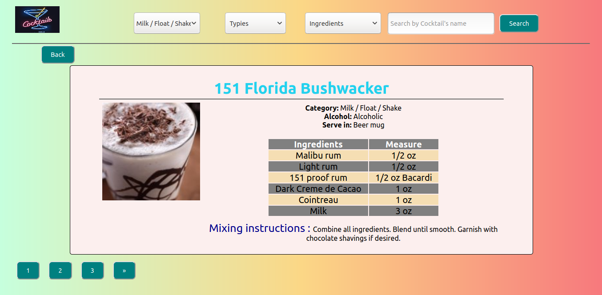
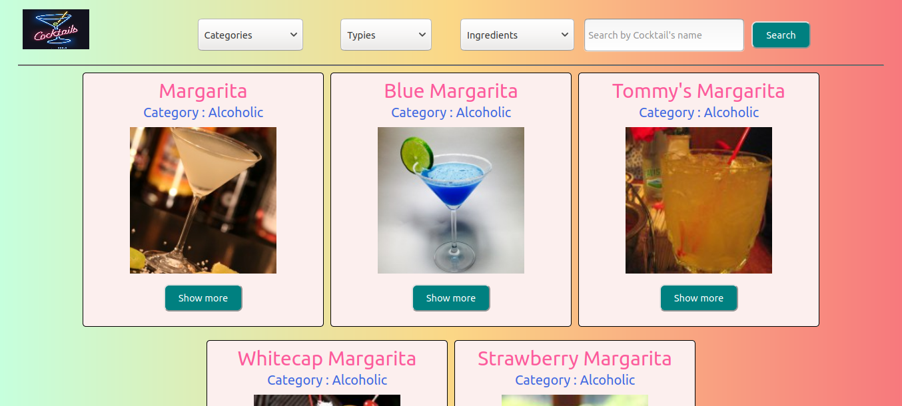
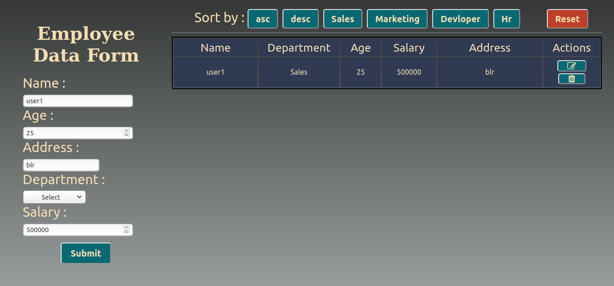
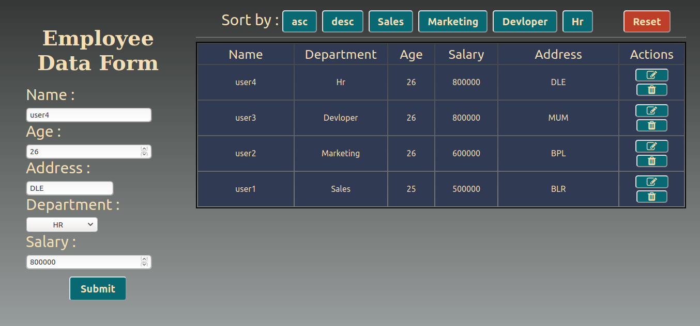
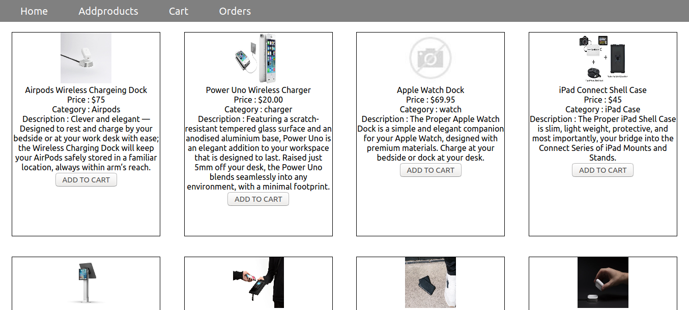
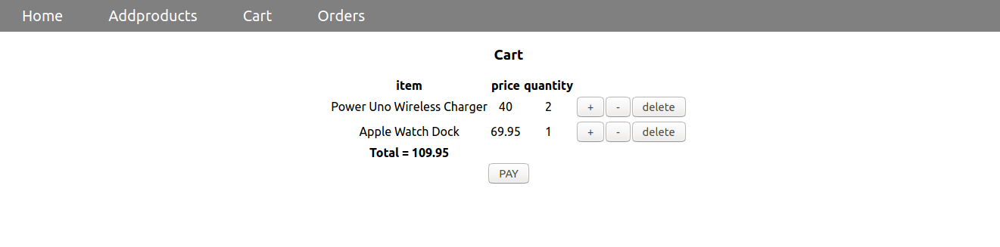
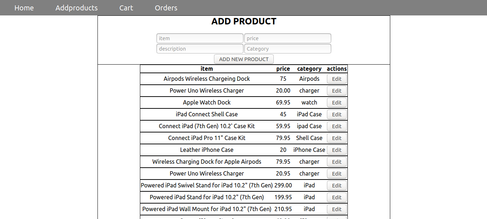
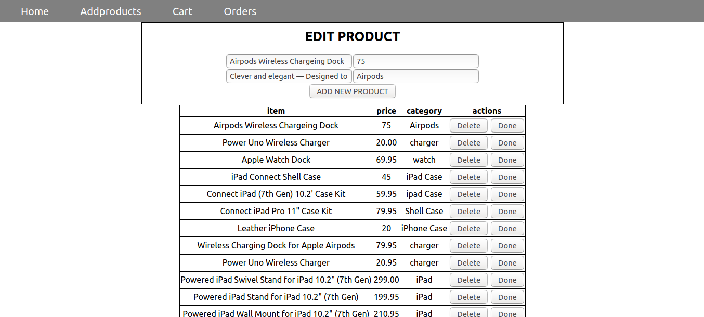
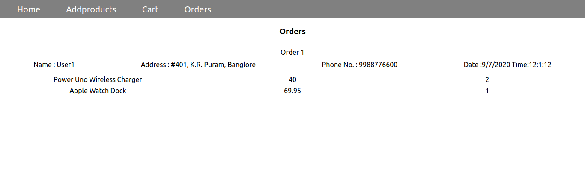

# React Projects

<p align="center">This repository in a home to a bunch of React projects, incorporating features like <em>Redux, Context API, Material UI and Bootstrap</em>. All these projects are deployed using <a href="https://vercel.com">Vercel</a>, the details about which can be found below and the links to projects in the respective headers. Towards the end of the content, you can find instructions to getting started with the projects in the repository.</p>


## Table of Contents

* [About the Projects](#about-the-projects)
	* [CocktailDB](#cocktail-db) 
	* [Food For Thought](#food-for-thought) 
	* [React Form](#react-form) 
	* [Shopping Cart using Redux](#shopping-cart-using-redux) 
	* [Restaurant Details](#restaurant-details) 
	* [Timer and Stopwatch](#timer-and-stopwatch) 
	
* [Getting Started](#getting-started)
  * [Prerequisites](#prerequisites)
  * [Installation](#installation)

## About The Projects

* ### [Cocktail DB](https://cocktailhub.now.sh/)
	Cocktail DB is a web application which serves users with paginated recipes on tons of cocktails. The user can filter through these cocktails based on categories, types or ingredients. The application also allows user to search cocktails by their names. Furthermore, it is equipped with loader for a better user experience. The code can found <a href="https://github.com/pankaj-404/react-projects/tree/master/CocktailDB/cocktail-db">here</a>.<br>
	The application is built with :
	* [Axios](https://github.com/axios/axios)
	* [API](https://www.thecocktaildb.com/api.php)
	
<p align="center">

</p>
	
	
* ### [Food For Thought](https://foodforthought.now.sh/)
	This web application houses a ton of paginated quotes, which a user can surf through. It is also capable of fetching quotes randomly, if user chooses so.  The code can found <a href="https://github.com/pankaj-404/react-projects/tree/master/foodforthought">here</a>.<br>
	The application is built with :
	* [Axios](https://github.com/axios/axios)
	* [API](https://programming-quotes-api.herokuapp.com/quotes/)
	
* ### [React Form](https://react-form-rho.vercel.app/)
	This a web application is aimed to be an Employee Management System with CRUD operations. It allows customer to complete the form with employee details and push them to the Table, which is collection of all the data, which can later be deleted, if chosen. The tabulated data can be sorted based on the salary in the order customer chooses. In addition to this, the application allows to filter the employee data based on department. The code can found <a href="https://github.com/pankaj-404/react-projects/tree/master/react-form">here</a>.<br>

<p align="center"></p>

* ### [Shopping Cart using Redux](https://redux-shoping-cart.vercel.app/)
	The shopping cart application, allows the user to surf through electronic products, add them to cart and place the order by adding user details. The quantity of products can be adjusted in carts, before placing the order. An admin feature to add more products on website has also been planned. The code can found <a href="https://github.com/pankaj-404/react-projects/tree/master/redux-shoping-cart">here</a>.<br>
	The application is built with :
	* [Redux](https://redux.js.org)

<p align="center">

</p>

* ### [Restaurant Details](https://food-court.vercel.app/)
	This is a beginner's project, developed with an intent to understand the class and functional components, conditional rendering and sorting and filtering data. The application allows user to filter restaurants based on their ratings or the mode of payments they accept. The code can found <a href="https://github.com/pankaj-404/react-projects/tree/master/restaurantdetails">here</a>.
	
  <p align="center"></p>
  
* ### [Timer and Stopwatch](https://timer-stopwatch-phi.vercel.app/)
	This is a beginner's project for a timer and stopwatch. The application allows user to filter restaurants based on their ratings or the mode of payments they accept. The code can found <a href="https://github.com/pankaj-404/react-projects/tree/master/timer_stopwatch">here</a>.

  <p align="center"></p>
  
## Getting Started

To get a local copy up and running follow these simple steps.

### Prerequisites

* npm
```
npm install npm@latest -g
```


### Installation
 
1. Clone the repo
```
git clone https://github.com/.....git
```
2. Go inside folder(parallel to package.json) and then install NPM packages
```
npm install
```
3. Start on localhost
 ```
npm start 
```


